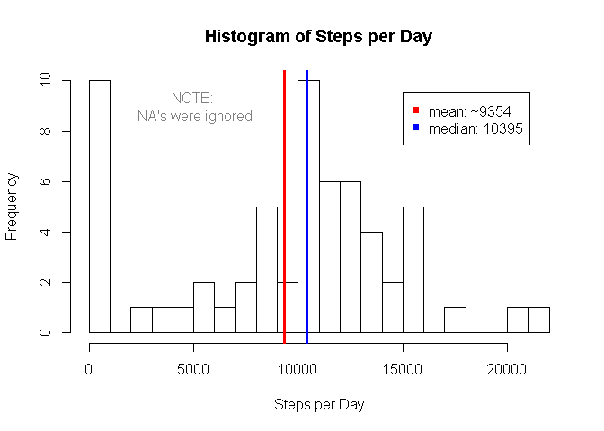
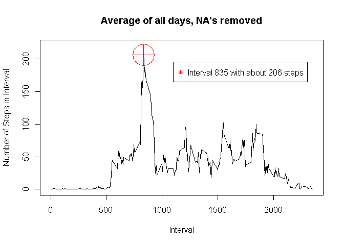
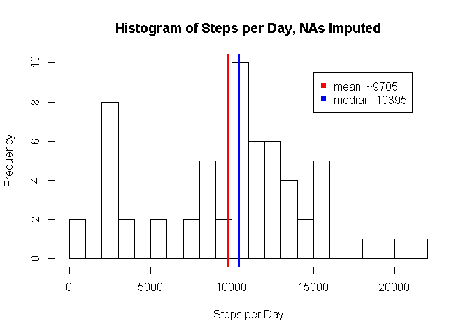
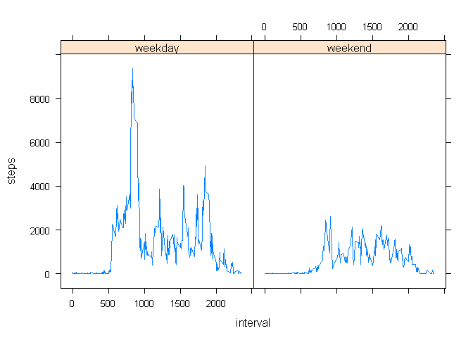

***
## Loading and preprocessing the data

First, we obtained the necessary data from the GitHub repository.


```r
# Download from GitHub
download.file(
        "https://github.com/borgo-larici/RepData_PeerAssessment1/raw/master/activity.zip",
        destfile = "activity.zip"
)


# Unzip and read into data frame
df <- read.csv(
        file = unz("activity.zip", "activity.csv"),
        header = TRUE,
        quote="\"",
        sep=","
)
```

Preview of the raw data:

```r
head(df)
```

```
##   steps       date interval
## 1    NA 2012-10-01        0
## 2    NA 2012-10-01        5
## 3    NA 2012-10-01       10
## 4    NA 2012-10-01       15
## 5    NA 2012-10-01       20
## 6    NA 2012-10-01       25
```

To answer the first exam question, we aggregated this by date, removing NA's. 


```r
# Prepare dplyr
library(dplyr)

# Create tbl
tbl <- tbl_df(df)

# Change "date" variable from factor to date
tbl <- mutate(tbl, date = as.Date(as.character(date), format = "%Y-%m-%d"))

# Group by date
tbl <- group_by(tbl, date)

# Remove NA's and summarize by date
tbl.daily.steps <- summarize(tbl, steps = sum(steps, na.rm = T))

# Calc overall mean
mean.steps.per.day <- mean(tbl.daily.steps$steps)
```

***
## What is mean total number of steps taken per day?

The overall mean total steps per day was **9354.2295082**.

> INSTRUCTION: Make a histogram of the total number of steps taken each day.  Calculate and report the mean and median total number of steps taken per day

We used the code below to display median and mean overlaid on a histogram.


```r
# Plot to histogram
hist(tbl.daily.steps$steps,
     main = "Histogram of Steps per Day",
     xlab = "Steps per Day",
     breaks = 30
)
# Plot mean
tds.mean <- mean(tbl.daily.steps$steps)
abline(v = tds.mean, col="red", lwd=3)

# Plot median
tds.median <- median(tbl.daily.steps$steps)
abline(v = tds.median, col="blue", lwd=3)

# Add legend
tds.mean.text <- paste("mean: ~", as.character(round(tds.mean)), sep = "")
tds.median.text <- paste("median: ", as.character(tds.median), sep = "")
legend(
        legend = c(tds.mean.text, tds.median.text), 
        col = c("red", "blue"), 
        x = 15000, 
        y = 9.5, 
        pch=15
)    

# Add disclaimer
text(5000,9,"NOTE:\n NA's were ignored", col = "grey50")
```

<!-- -->

***
## What is the average daily activity pattern?

The average daily activity pattern shows one large peak.  This is clearly
visible on the next plot below.

> INSTRUCTION: Make a time series plot (i.e. type = "l") of the 5-minute interval (x-axis) and the average number of steps taken, averaged across all days (y-axis)

To obtain the average daily activity pattern, we re-grouped and summarized 
the main dataset by interval.  

```r
# Group by interval
tbl <- group_by(tbl, interval)

# Summarize by interval
tbl.steps.by.interval <- summarize(tbl, steps = mean(steps, na.rm = TRUE))
```

We then plotted this time series and reported the interval with the highest average steps.


```r
# Plot as time series
plot(
        tbl.steps.by.interval$interval, 
        tbl.steps.by.interval$steps, 
        type = "l", 
        xlab = "Interval", 
        ylab = "Number of Steps in Interval",
        ylim = c(0, 220),
        main = "Average of all days, NA's removed"
)

# Report which 5-minute interval has the highest number of steps
busiest.interval.id <- which.max(tbl.steps.by.interval$steps)
busiest.interval <- tbl.steps.by.interval$interval[busiest.interval.id]
avg.steps.in.busiest.interval <- 
        round(tbl.steps.by.interval$steps[busiest.interval.id])
points(
        busiest.interval, 
        avg.steps.in.busiest.interval,
        col = "red",
        pch = 10,
        cex = 6
)

# Add legend
txt <- paste(
        "Interval", 
        as.character(busiest.interval), 
        "with about", 
        as.character(avg.steps.in.busiest.interval), 
        "steps"
)
legend(
        legend = txt,
        col ="red", 
        x = 1100, 
        y = 195, 
        pch = 10
)   
```

<!-- -->

> INSTRUCTION: Which 5-minute interval, on average across all the days in the dataset, contains the maximum number of steps?

The interval with the highest average steps is **835**, with 
average steps of about **206**, marked in red in the plot
above.

***
## Imputing Missing Values

> INSTRUCTION: Calculate and report the total number of missing values in the dataset (i.e. the total number of rows with NAs)


```r
num.missing.values <- sum(is.na(df$steps))
```

The number of missing values is **2304**.

> INSTRUCTION: Devise a strategy for filling in all of the missing values in the dataset.  Create a new dataset that is equal to the original dataset but with the missing data filled in.

We replaced each missing value with the median for the corresponding interval
and day of week.


```r
# Create day-of-week variable in main tibble
tbl <- mutate(tbl, dow = weekdays(date))

# Group by dow and interval
tbl <- group_by(tbl, dow, interval)

# Create tibble of median steps
median.steps.tbl <- summarize(tbl, imputed.steps = median(steps, na.rm = T))

# Build tibble that contains all the old fields plus the calculated medians
imputed.tbl <- 
        left_join(
                tbl,
                median.steps.tbl,
                by = c("interval","dow")
        )

# Make the imputed.tbl equivalent to the original tbl, but with imputed data
# in the place of NA's.
imputed.tbl <- 
        mutate(
                imputed.tbl, 
                # Use imputed value if existing value is NA
                steps = if_else(!is.na(steps), steps, as.integer(round(imputed.steps)))
        )
# Group by date
imputed.tbl <- group_by(imputed.tbl, date)
# Discard unwanted values
imputed.tbl <- select(imputed.tbl, steps, date, interval)

# Preview the data
head(imputed.tbl)
```

```
## # A tibble: 6 x 3
## # Groups:   date [1]
##   steps date       interval
##   <int> <date>        <int>
## 1     0 2012-10-01        0
## 2     0 2012-10-01        5
## 3     0 2012-10-01       10
## 4     0 2012-10-01       15
## 5     0 2012-10-01       20
## 6     0 2012-10-01       25
```


> INSTRUCTION: Make a histogram of the total number of steps taken each day and Calculate and report the mean and median total number of steps taken per day. 


```r
# Summarize by date
tbl.daily.steps <- summarize(imputed.tbl, steps = sum(steps))

# Plot to histogram
hist(tbl.daily.steps$steps,
     main = "Histogram of Steps per Day, NAs Imputed",
     xlab = "Steps per Day",
     breaks = 30
)
# Plot mean
tdsi.mean <- mean(tbl.daily.steps$steps)
abline(v = tdsi.mean, col="red", lwd=3)

# Plot median
tdsi.median <- median(tbl.daily.steps$steps)
abline(v = tdsi.median, col="blue", lwd=3)

# Add legend
tdsi.mean.text <- paste("mean: ~", as.character(round(tdsi.mean)), sep = "")
tdsi.median.text <- paste("median: ", as.character(tdsi.median), sep = "")
legend(
        legend = c(tdsi.mean.text, tdsi.median.text), 
        col = c("red", "blue"), 
        x = 15000, 
        y = 9.5, 
        pch=15
)    
```

<!-- -->

> INSTRUCTION: Do these values differ from the estimates from the first part of the
assignment? What is the impact of imputing missing data on the estimates of the total 
daily number of steps?

After imputing NA's, the median has stayed the same.  The mean has shifted 
rightward from **mean: ~9354** to **mean: ~9705**.

***
## Are there differences in activity patterns between weekdays and weekends?

> INSTRUCTION: Create a new factor variable in the dataset with two levels – “weekday” and “weekend” indicating whether a given date is a weekday or weekend day.


```r
# Create a function that takes a date and returns either "weekend" or "weekday"
wow <- function(x) 
        if_else (grepl("Saturday|Sunday", weekdays(x)), "weekend", "weekday")

# Add a "Weekend.or.Weekday" variable to the imputed.tbl 
imputed.tbl <- mutate(imputed.tbl, Weekend.or.Weekday = wow(date))

# Turn "Weekend.or.Weekday" into a factor
imputed.tbl <- mutate(imputed.tbl,
       Weekend.or.Weekday = 
               factor(Weekend.or.Weekday, levels = c("weekday","weekend"))
       )

# Preview the data
head(imputed.tbl)
```

```
## # A tibble: 6 x 4
## # Groups:   date [1]
##   steps date       interval Weekend.or.Weekday
##   <int> <date>        <int> <fct>             
## 1     0 2012-10-01        0 weekday           
## 2     0 2012-10-01        5 weekday           
## 3     0 2012-10-01       10 weekday           
## 4     0 2012-10-01       15 weekday           
## 5     0 2012-10-01       20 weekday           
## 6     0 2012-10-01       25 weekday
```

> INSTRUCTION: Make a panel plot containing a time series plot (i.e. type = "l") of the 5-minute interval (x-axis) and the average number of steps taken, averaged across all weekday days or weekend days (y-axis)


```r
# Group the imputed.tbl by Weekend.or.Weekday and interval
imputed.tbl <- group_by(imputed.tbl, Weekend.or.Weekday, interval)

# Summarize and filter to end up with two time series--Weekend and Weekday.
imputed.tbl <- summarize(imputed.tbl, steps = sum(steps))

# Prepare lattice
library(lattice)

# Build plot
xyplot(
        steps ~ interval | factor(Weekend.or.Weekday),
        data=imputed.tbl, 
        type = "l"
)
```

<!-- -->

The plot above demonstrates the following:

* Differences

    + Weekend activity was lower overall, as compared to weekday.
      
    + Weekend peak activity was much lower (less than half) as compared to weekday peak.
        
* Similarities

    + The "inert" hours are roughly the same, probably corresponding to sleep.
        
    + Both time series show maximum activity around the same time of day.


